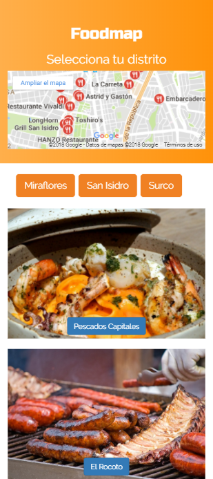

# Foodmap

## Objetivos

El presente trabajo debe cumplir los siguientes requisitos:

- Vista splash con duración de 2 a 5 segundos que redirecciona a tu vista principal. 

- En la vista principal se muestran todos los restaurantes "cerca de ti" junto con el input para filtrar tu elección

- Deben mostrarse únicamente aquellos restaurantes que cumplan con la condición. 

- Agrega un evento mouseover a las imágenes, lo que pase con el efecto es decisión tuya (Cambio de tamaño, muestra de texto, cambio de imagen, información, etc). 

- Al seleccionar alguno de los restaurantes, deberá mostrarse la información de este a través de un modal. 

-Una vez cerrado el modal debe volver a la vista principal. 

## Flujo de la aplicación

## Desarrollado con:

`HTML5` `Jquery` `CSS3` `Bootstrap`
